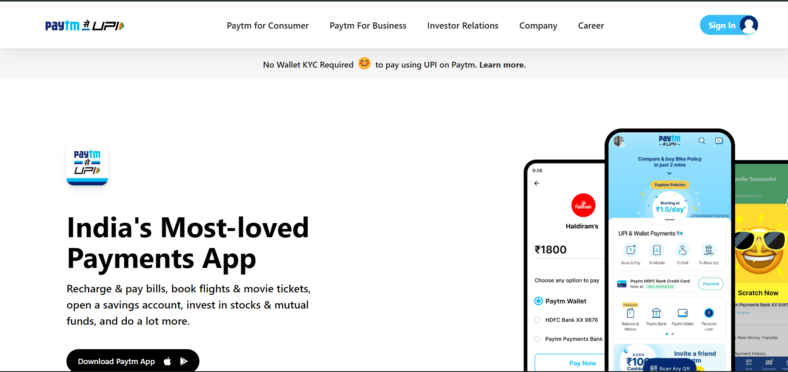

# [Project 17](https://jagadeeshproject17.netlify.app/)

 

# [Paytm Clone Website Home Page](https://jagadeeshproject17.netlify.app/)

  

  

>**Learnings from the project**

- How to work with Tailwind css using cdn link
- media-queries & responsiveness-mobile responsiveness as well in tailwind css
- Importance of comments in code. Without them code will be messy and it becomes difficult. Literally spent too much time because of not commiting.
- Always design for mobile's first. Then it will be easy to work.

  

  &nbsp; 

 
